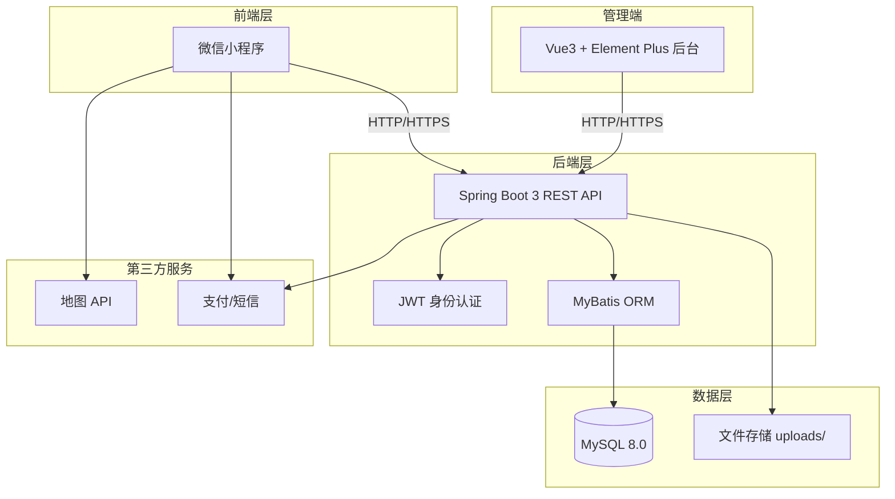
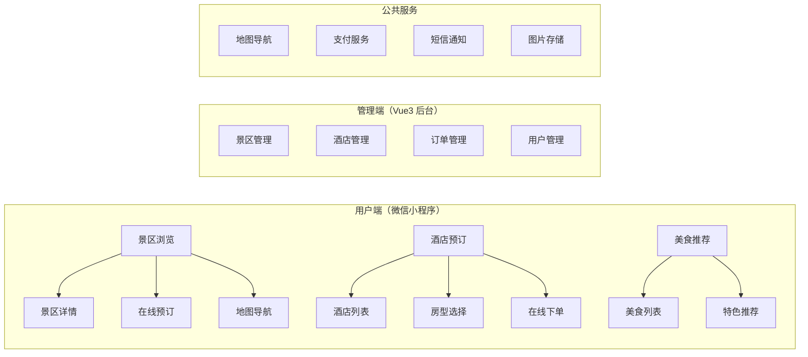
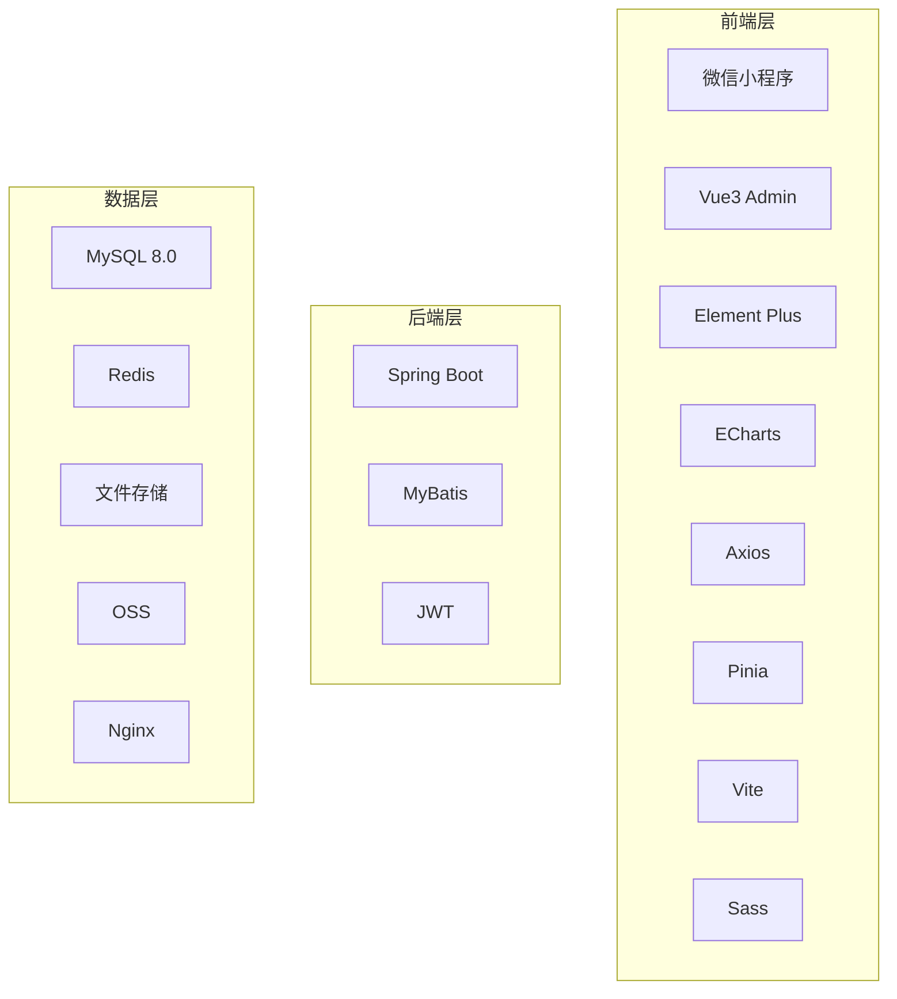
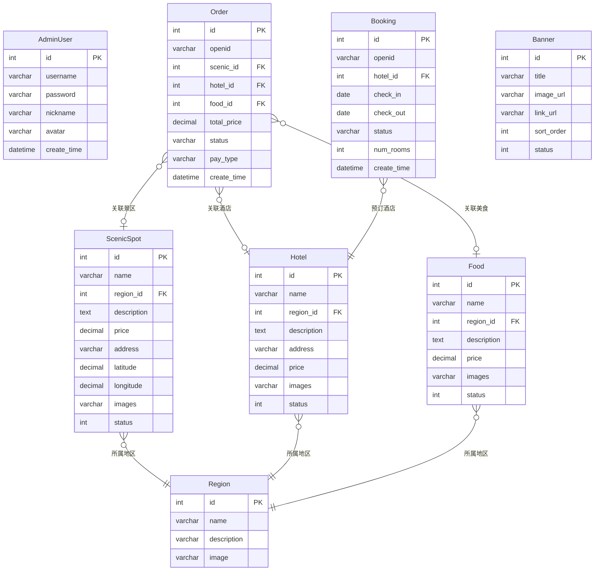

# 千游 - 智慧文旅平台

> 基于 **微信小程序 + Vue3 管理后台 + Spring Boot 后端** 的智慧文旅综合服务平台，集景区导览、酒店预订、美食推荐、订单管理于一体，为游客和管理者提供一站式文旅解决方案。

---

## 项目截图

### 管理后台
| 登录页 | 仪表盘 |
|:---:|:---:|
|  |  |

| 景区管理 | 酒店管理 | 订单管理 |
|:---:|:---:|:---:|
|  |  |  |

---

## 系统架构



## 核心功能模块



## 技术架构详情



## 数据库 ER 图



## 技术栈

| 层级 | 技术 | 说明 |
|------|------|------|
| **用户端** | 微信小程序原生开发 | 20+ 页面覆盖文旅全场景 |
| **管理后台** | Vue 3 + Element Plus + Pinia + ECharts | SPA 应用，Vite 构建 |
| **后端** | Spring Boot 3 + MyBatis | RESTful API，16 个 Controller |
| **数据库** | MySQL 8.0 | 14 张数据表 |
| **安全** | JWT + BCrypt | 身份认证与权限管理 |
| **支付** | 微信支付 API | 支持小程序内支付 |
| **地图** | 腾讯/高德地图 API | 景区导航与位置服务 |

## 项目结构

```
wx--s/
├── pages/                    # 小程序页面
│   ├── index/                # 首页/景区推荐
│   ├── discover/             # 发现页/攻略
│   ├── search/               # 搜索
│   ├── list/                 # 景点列表
│   ├── scenic-detail/        # 景点详情
│   ├── navigation/           # 导航
│   ├── my/                   # 个人中心
│   ├── my-orders/            # 我的订单
│   ├── my-bookings/          # 我的预订
│   ├── login/                # 登录
│   ├── feedback/             # 意见反馈
│   └── history/              # 浏览历史
├── packageDetail/            # 套餐详情分包
├── packageFood/              # 美食分包
├── packageHotel/             # 酒店分包
├── utils/                    # 工具函数
├── admin-vue/                # Vue3 管理后台
│   ├── src/api/              # API 接口（14个模块）
│   └── src/views/            # 页面视图（16个页面）
└── backend/                  # Spring Boot 后端
    └── src/main/java/com/example/tourism/
        ├── controller/       # 15 个 Controller
        ├── service/          # 业务逻辑层
        ├── mapper/           # MyBatis Mapper
        ├── entity/           # 14 个实体类
        └── config/           # 配置（JWT/CORS等）
```

## 快速开始

### 后端

```bash
cd backend
# 创建数据库
mysql -u root -p -e "CREATE DATABASE tourism_db DEFAULT CHARSET utf8mb4;"
# 导入SQL
mysql -u root -p tourism_db < query
# 启动
mvn spring-boot:run
```

### 管理后台

```bash
cd admin-vue
npm install
npm run dev
# 访问 http://localhost:3000
```

### 微信小程序

1. 下载微信开发者工具
2. 导入项目 `wx--s/`
3. 配置 AppID
4. 编译运行

## 项目统计

- **Controller**: 15 个
- **API 接口**: 60+ 个 RESTful 接口
- **数据表**: 14 张
- **小程序页面**: 20+ 个
- **后台页面**: 16 个
- **代码量**: 约 15,000+ 行

## 核心特性

- ✅ JWT 身份认证 + BCrypt 密码加密
- ✅ 基于微信 openid 的用户体系
- ✅ 景区、酒店、美食全流程管理
- ✅ 小程序内在线支付
- ✅ 地图导航与位置服务
- ✅ 短信验证码通知
- ✅ ECharts 数据可视化仪表盘
- ✅ 图片上传与管理

## 开源协议

MIT